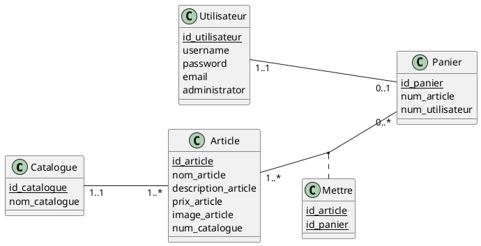

# Amanoz

1. Création d'un site web qui interroge une base de données 
2. Faire du Crud depuis le site, c'est à dire (Afficher, Créer, Supprimer les Articles).

## <u>Diagramme de classe</u> :



## Base de données :

```sql
DROP database if exists dbamanoz;
CREATE DATABASE dbamanoz DEFAULT CHARACTER SET utf8 COLLATE utf8_swedish_ci;
USE dbamanoz;

CREATE TABLE Utilisateur(
	id_utilisateur INTEGER NOT NULL Auto_Increment,
	username varchar(100) NOT NULL,
	password varchar(40) NOT NULL,
	email varchar(100) NOT NULL,
	administrator Boolean,
	PRIMARY KEY(id_utilisateur)
);

CREATE TABLE Catalogue(
	id_catalogue INTEGER NOT NULL Auto_Increment,
	nom_catalogue varchar(50),
	PRIMARY KEY(id_catalogue)
);

CREATE TABLE Article(
	id_article INTEGER NOT NULL Auto_Increment,
	nom_article varchar(100),
	description_article varchar(1000),
	prix_article float,
	image_article varchar(150),
	num_catalogue INTEGER NOT NULL,
	PRIMARY KEY(id_article),
	FOREIGN KEY(num_catalogue) REFERENCES Catalogue(id_catalogue)
);

CREATE TABLE Panier(
	id_panier INTEGER NOT NULL Auto_Increment,
	num_utilisateur INTEGER,
	passer Boolean,
	PRIMARY KEY(id_panier),
	FOREIGN KEY(num_utilisateur) REFERENCES Utilisateur(id_utilisateur)
);

CREATE TABLE Mettre(
	id_article INTEGER,
	id_panier INTEGER,
	PRIMARY KEY(id_article,id_panier),
	FOREIGN KEY(id_article) REFERENCES Article(id_article),
	FOREIGN KEY(id_panier) REFERENCES Panier(id_panier)
);

```

