# Amanoz Vuln

## Contexte : Projet php e-commerce, vulnérable introduction au pentest.

## <u>Cas d'utilisation Client</u> :

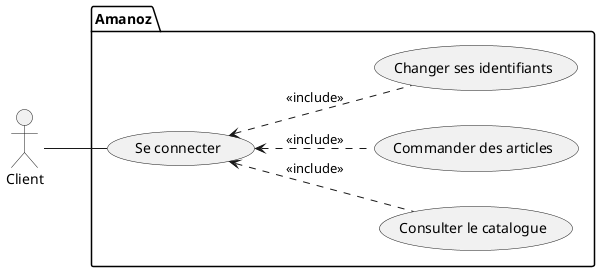

## <u>Cas d'utilisation Admin</u> :
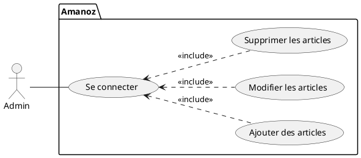
## <u>Diagramme de classe</u> :

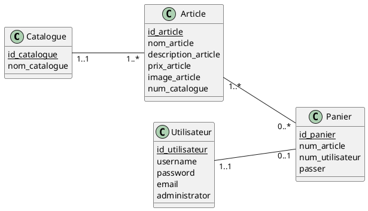

## <u>Base de données</u> :

```sql
DROP database if exists dbamanoz;
CREATE DATABASE dbamanoz DEFAULT CHARACTER SET utf8 COLLATE utf8_swedish_ci;
USE dbamanoz;

CREATE TABLE Utilisateur(
	id_utilisateur INTEGER NOT NULL Auto_Increment,
	username varchar(100) NOT NULL,
	password varchar(40) NOT NULL,
	email varchar(100) NOT NULL,
	administrator Boolean,
	PRIMARY KEY(id_utilisateur)
);

CREATE TABLE Catalogue(
	id_catalogue INTEGER NOT NULL Auto_Increment,
	nom_catalogue varchar(50),
	PRIMARY KEY(id_catalogue)
);

CREATE TABLE Article(
	id_article INTEGER NOT NULL Auto_Increment,
	nom_article varchar(100),
	description_article varchar(1000),
	prix_article float,
	image_article varchar(150),
	num_catalogue INTEGER NOT NULL,
	PRIMARY KEY(id_article),
	FOREIGN KEY(num_catalogue) REFERENCES Catalogue(id_catalogue)
);

CREATE TABLE Panier(
	id_panier INTEGER NOT NULL Auto_Increment,
	num_article INTEGER,
	num_utilisateur INTEGER,
	passer Boolean,
	PRIMARY KEY(id_panier),
	FOREIGN KEY(num_utilisateur) REFERENCES Utilisateur(id_utilisateur),
	FOREIGN KEY(num_article) REFERENCES Article(id_article)
);

```

### En admin :

je me connecte à l'interface de connexion pour accéder au site  :
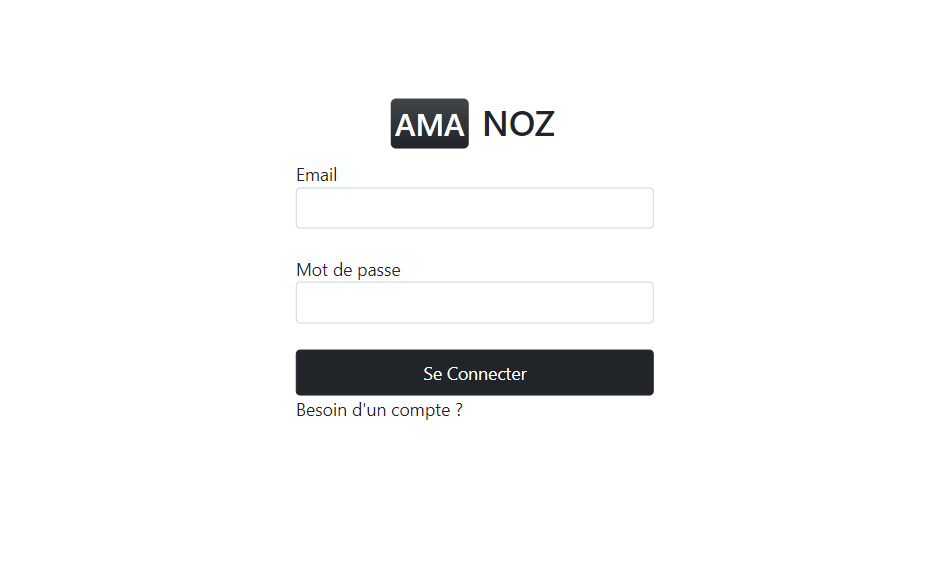

Les clients ont la possiblité de créer un compte :
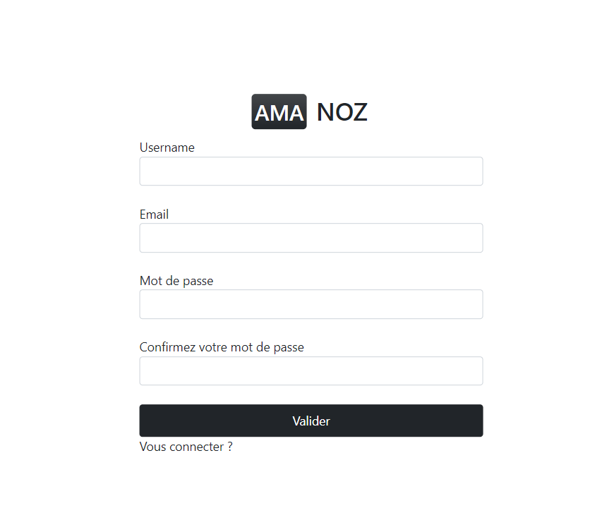

 La page accueil.php :

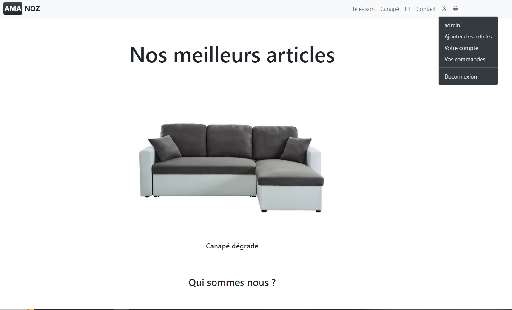

Nous pouvons voir les différents articles du catalogue Lit depusi cette page nous avons la possiblité de modifier et de supprimer l'article :

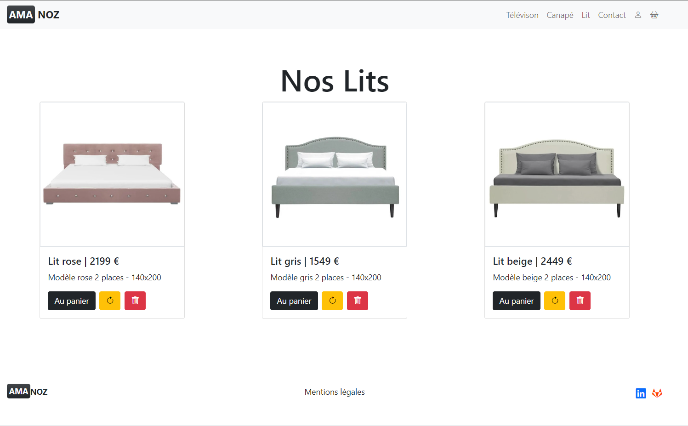

Pour ajouter un article je clique sur l'icone de  l'utilisateur :

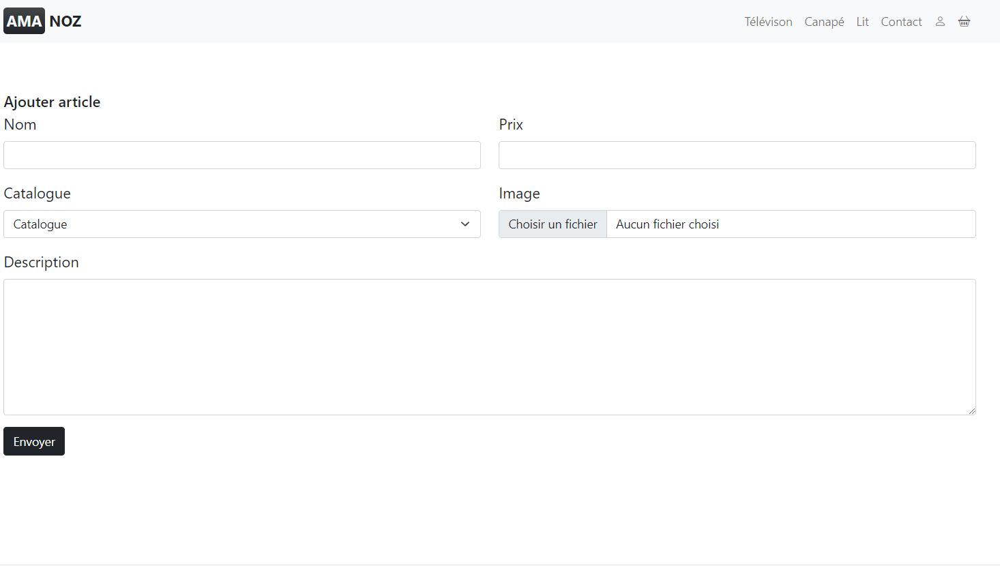


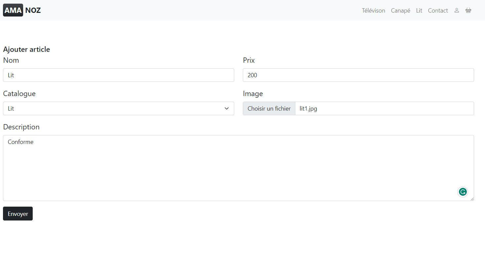

le produit a bien été modifiée et  pour modifier l'article je clique sur l'icone jaune du produit :

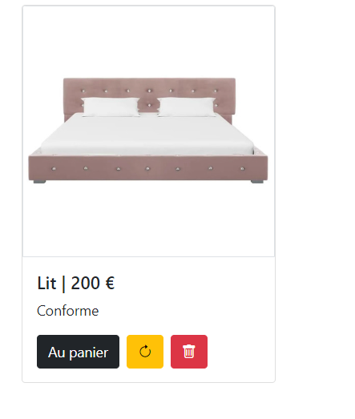
 

Modification du projet :

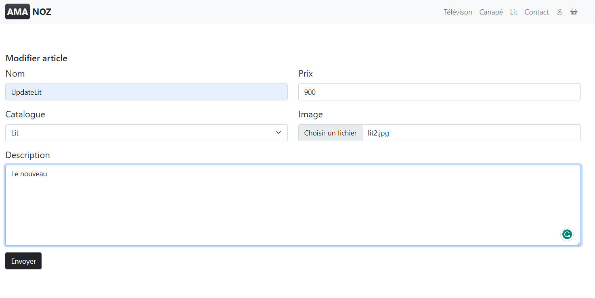

Le produit a bien été modifiée :

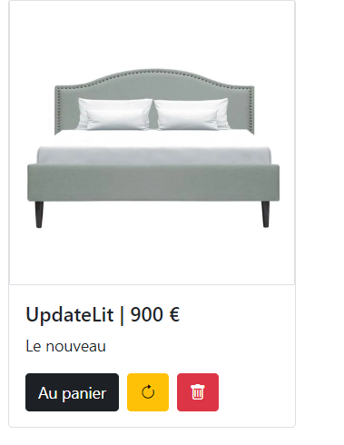

Pour supprimer un produit, je clique sur l'icone rouge du produit :

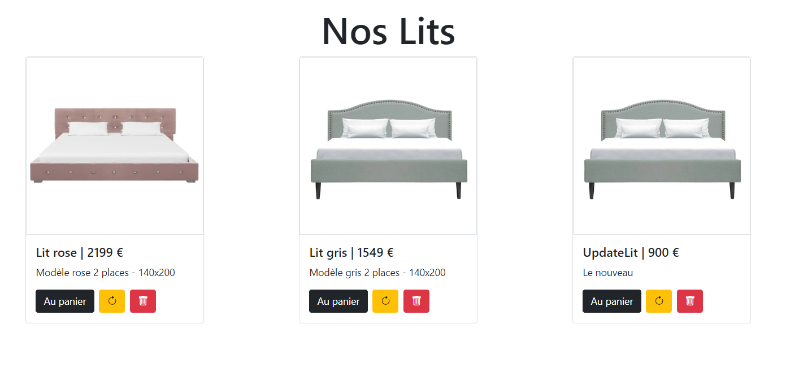

Le produit a bien été supprimée :

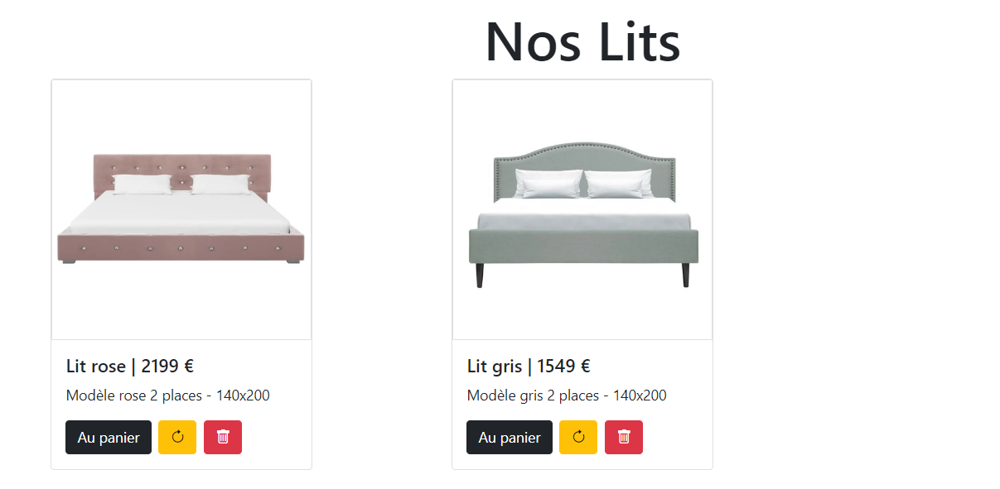

## Client :

Je me connecte en tant qu'utilisateur :

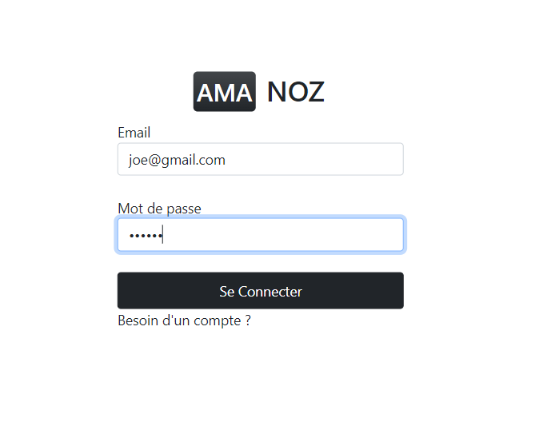

accueil.php connecter en tant que Joe :

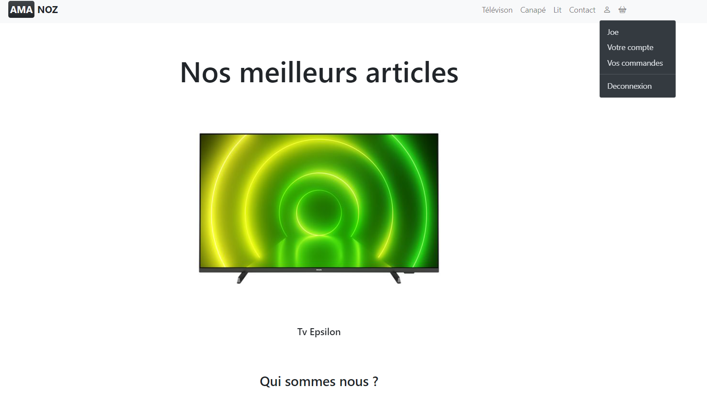

Les articles :

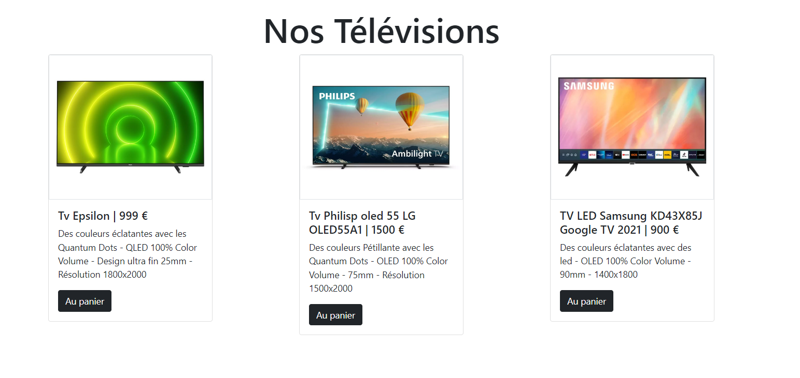

Le panier de l'utilisateur connectée:

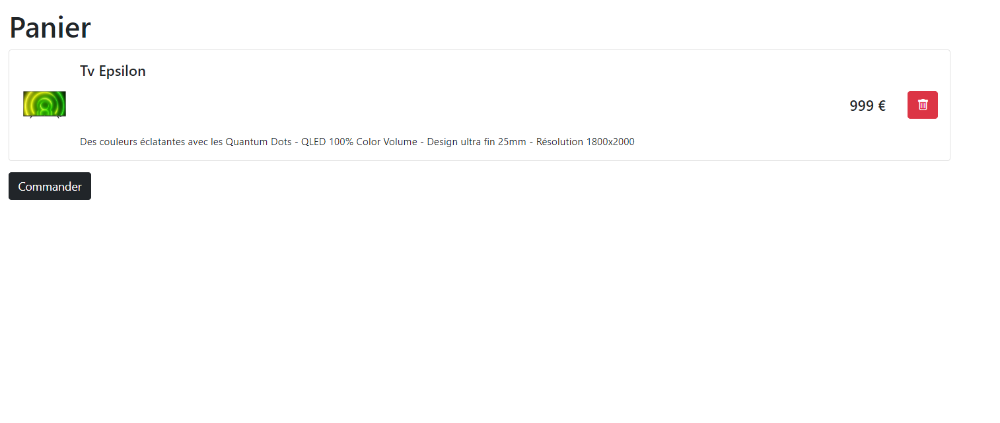

Après avoir commandée je consulte mes commandes :

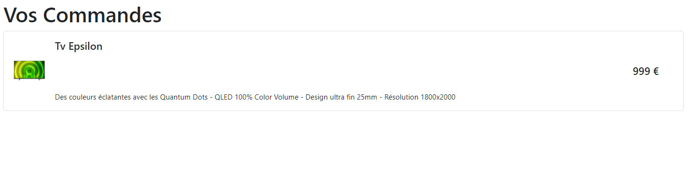

L'utilisateur a la possibilitée de modifier ses identifiants :

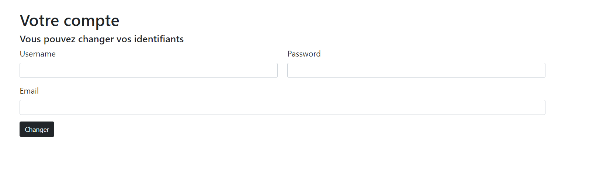

Les saisies :

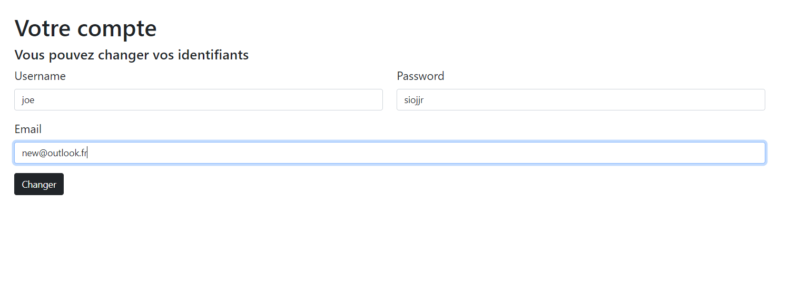

Connection :

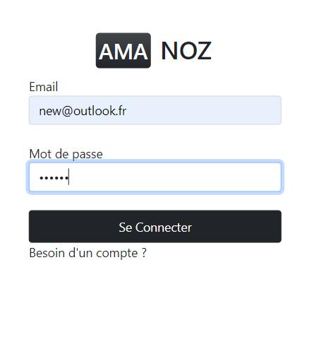

Les identifiants de joe ont bien été modifiées :

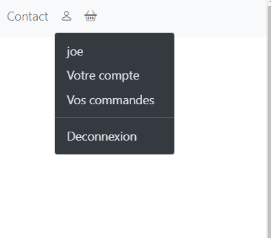